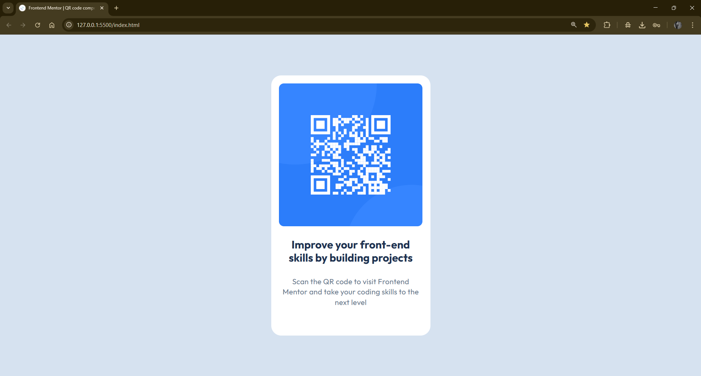
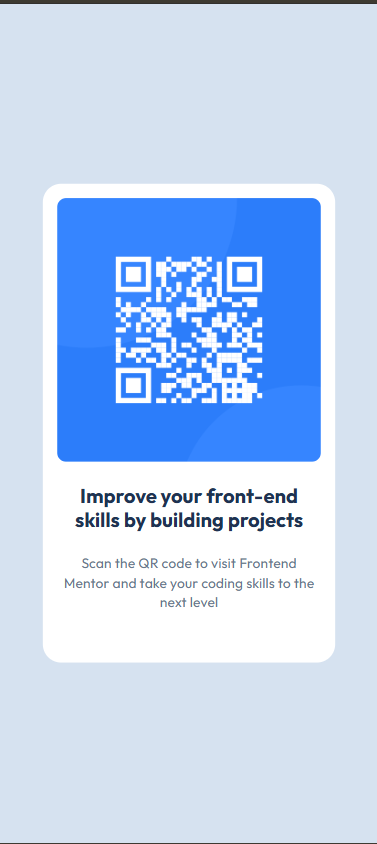

# Frontend Mentor - QR Code Component


## 🌟 Visão Geral

Este é meu projeto do desafio **QR Code Component** do [Frontend Mentor](https://www.frontendmentor.io). Olha, por mais que foi um design simples, eu vejo muita expectativa no Frontend Mentor. Consegui aprender bastante e me diverti criando!

### 🔗 Links

- Solução URL: [Adicione sua URL aqui]
- Live Site URL: [Adicione sua URL aqui]

## 📸 Screenshot




## 🛠️ Tecnologias Utilizadas

- HTML5 semântico
- CSS3 customizado
- Flexbox para centralização
- CSS Variables (Custom Properties)
- Google Fonts (Outfit)
- Design responsivo com `max-width`

## 💡 O Que Eu Aprendi

### 🎯 Flexbox - O Jogo Virou!

O maior desafio foi definitivamente **entender Flexbox**. Aprendi conceitos fundamentais como:

- **Eixo principal vs eixo cruzado**: `justify-content` trabalha no eixo horizontal, `align-items` no vertical
- **Centralização perfeita**: Combinando `display: flex`, `justify-content: center` e `align-items: center`
- **Hierarquia**: Entender quem é o container (pai) e quem são os items (filhos)

```css
/* Centralização que finalmente fez sentido! */
body { 
    display: flex;
    justify-content: center;
    align-items: center;
    min-height: 100vh;
}
```

### 📐 Grid vs Flexbox

Aprendi a diferença entre Grid e Flexbox:
- **Flexbox**: Para layouts em uma dimensão (linha OU coluna)
- **Grid**: Para layouts em duas dimensões (linhas E colunas)

Neste projeto, Flexbox foi perfeito pois só precisava centralizar um card.

### 🎨 Importância do Style Guide

Ter um **style guide** foi MUITO bom! Ele guiou o design completamente:
- Cores exatas em HSL
- Tamanhos de fonte definidos
- Espaçamentos padronizados
- Pesos de fonte específicos

Isso eliminou a adivinhação e tornou o processo muito mais profissional.

### 🔧 CSS Variables

Aprendi a usar Custom Properties para organizar melhor o código:

```css
:root {
    --White: hsl(0, 0%, 100%);
    --Slate-300: hsl(212, 45%, 89%);
    --Slate-500: hsl(216, 15%, 48%);
    --Slate-900: hsl(218, 44%, 22%);
}
```

Isso deixa o código mais limpo e fácil de manter!

## 🚀 Desenvolvimento Contínuo

Áreas que quero melhorar:
- [ ] Praticar mais com Grid Layout
- [ ] Explorar animações CSS
- [ ] Aprender sobre acessibilidade (ARIA labels)
- [ ] Dominar media queries para designs mais complexos

## 🙏 Agradecimentos

- **Frontend Mentor** - Pelos desafios práticos e realistas
- **Comunidade Frontend Mentor** - Pelo suporte e inspiração

## 👨‍💻 Autor

- Frontend Mentor - [@VitorLangkamar](https://www.frontendmentor.io/profile/VitorLangkamar)
- GitHub - [@VitorLangkamar](https://github.com/VitorLangkamar)

---

**"Aprender fazendo é muito melhor do que depender da IA!"** 🎯
